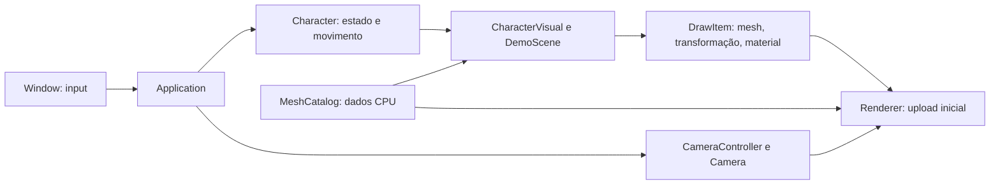

# Organização dos módulos

A aplicação conecta as partes; cada módulo cuida de uma responsabilidade. O domínio do jogo não depende de janela, renderer ou assets visuais. GLM é uma biblioteca de matemática CPU, não uma dependência de GPU.

## Estrutura implementada

```text
src/
  apps/client/        ponto de entrada e composição do cliente
  platform/           Window, contexto e eventos GLFW
  math/               convenções e transformações sobre GLM
  assets/             MeshData, MeshCatalog e meshes procedurais CPU
  scene/              Camera, CameraController, Material e DrawItem
  renderer/           Renderer, Shader e Mesh (recursos GPU)
    opengl/           implementação do shader e buffers OpenGL
  game/
    characters/       Character: posição, orientação e movimento
    items/            ItemDefinition e ItemStack
    world/            limites de movimento do protótipo
    client/           DemoScene e CharacterVisual: aparência e animação
content/              convenções para arquivos de conteúdo futuros
tests/                verificações CPU sem janela
```

`assets/` contém o código que representa recursos, enquanto `content/` é o lugar dos arquivos artísticos. Ainda não existe importador de modelos ou texturas: as meshes atuais são procedurais.

## Fluxo de um frame



Renderer não recebe `player_x`, `player_yaw` ou fase de caminhada. Ele recebe câmera e desenhos. Um personagem, uma pedra ou um item podem produzir a mesma estrutura `DrawItem` sem adicionar condicionais de gameplay no renderer.

## Ownership e contratos

- `Character` encapsula posição e orientação. Input é uma intenção (`MovementInput`), sem códigos de tecla ou chamadas GLFW. O limite de tempo de frame continua na aplicação; tick fixo e autoridade de servidor ficam para o Marco 005.
- `CharacterVisual` mantém o estado de animação e monta as partes do personagem. Aparência não altera regras do domínio.
- `ItemDefinition` identifica conteúdo por ID textual, nome e limite de pilha. `ItemStack` possui uma cópia da definição e controla quantidade; zero representa pilha vazia. Adições/remoções inválidas não alteram o estado. Não há herança entre item e personagem, nem vínculo com MeshId.
- `MeshCatalog` possui meshes CPU e emite IDs locais. Um ID é válido somente para o catálogo de origem; não é ID persistente nem identificador de entidade.
- `Renderer` faz upload de um snapshot do catálogo ao ser construído. Adicione todas as meshes antes de construí-lo. Carregamento dinâmico e descarte por região são evoluções futuras, não comportamento disponível agora.
- `Mesh` e `Shader` possuem os recursos GPU e os liberam por RAII. Não podem ser copiados. O renderer deve ser destruído antes da janela/contexto; a ordem de variáveis na aplicação garante isso.
- `Material` é um valor com cor e padrão de superfície. `DrawItem` contém ID da mesh, matriz e material; não possui ponteiros para entidades.
- O span retornado por `DemoScene::update` vale até a próxima atualização ou destruição da cena. O renderer o consome imediatamente, sem armazená-lo.
- `Camera` calcula visão e projeção; `CameraController` converte mouse/scroll em órbita. O controlador retorna o delta de rotação, e a aplicação decide se também deve girar o personagem.

As convenções matemáticas são: mundo destro, Y para cima, frente do personagem em +Z, ângulos em radianos, matrizes column-major e composição `parent * local`. A projeção usa profundidade OpenGL de -1 a +1.

## Onde implementar a próxima funcionalidade

| Funcionalidade | Lugar |
| --- | --- |
| Importar modelo / textura para memória CPU | `assets/` |
| Arquivos originais de arte | `content/source/` quando existirem |
| Criar buffers / texturas GPU | `renderer/opengl/` |
| Atributos e regras de personagem | `game/characters/` |
| Definições de item, inventário e equipamento | `game/items/` |
| Aparência de equipamento ou personagem | `game/client/` |
| Limites, colisão e regras do mundo | `game/world/` |
| Sessões e sincronização | novos módulos `network/` e `game/server/` no Marco 005 |

## Orientação a objetos aplicada

A mudança corrige principalmente responsabilidade única e acoplamento: renderer não monta personagem, aplicação não implementa movimento, e itens não dependem da representação visual. O carregador de funções OpenGL é fornecido pela aplicação, removendo a dependência direta do renderer em Window.

Encapsulamento protege estado com invariantes (Character e ItemStack). Estruturas que apenas transportam dados (Material, MeshData, DrawItem) continuam sendo valores simples. Composição é suficiente para o estado atual; não há classe-base Entity, singleton global ou fábrica abstrata sem uso concreto. Liskov e segregação de interfaces não eram problemas demonstrados pelo código anterior, que não possuía essas hierarquias.

## Limites no build e validação

Os targets `mmo_game`, `mmo_assets`, `mmo_scene`, `mmo_presentation`, `mmo_platform` e `mmo_renderer` declaram suas dependências no CMake. `mmo_game` depende apenas de matemática e opções de compilação; `mmo_renderer` não depende de `mmo_game` ou `mmo_platform`.

`MMO_BUILD_CLIENT=OFF` remove GLFW, GLAD e o renderer do build. O CTest verifica velocidade diagonal, orientação, limites do mundo, pilhas de itens, compartilhamento de meshes, composição/animação e câmera. As bibliotecas CPU continuam disponíveis para um futuro servidor, mas não implementam ainda uma simulação autoritativa nem determinismo de rede.
